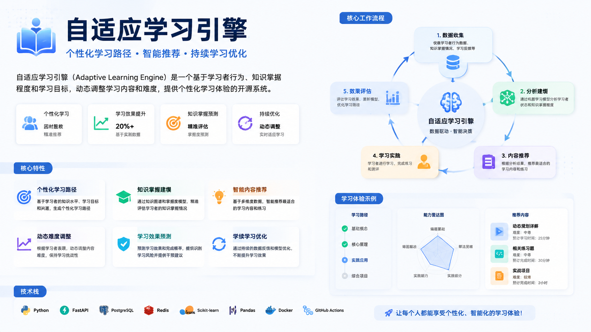

# adaptive-learning-engine-skill



按学习目标与当前水平组合学习路径、苏格拉底式互动和可续学进度的 AI Skill。仅当用户显式以名称或 `$adaptive-learning-engine-skill` 点名调用时触发，普通学习类问题不自动触发。

## 核心能力

- 学情诊断 → 知识地图 → 路径规划 → 内容生成 → 反馈校准 → 沉淀归档
- 三条主路径：A 渐进式卡片库 / B 速成深度教学 / C 资料地图整理
- 两种交互方式：直接讲解 / D 苏格拉底式提问（可与 A/B 叠加形成 `A+D`、`B+D`）
- Checkpoint 续学：跨会话/交给其他 AI 复用

## 目录结构

```
.
├── SKILL.md                              # 技能主文件：核心模型、Identity、输入解析、路径分流、停止规则
├── agents/
│   ├── openai.yaml                       # OpenAI 接口配置
│   └── claude.yaml                       # Claude Code 接口配置
└── references/
    └── learning-contracts.md             # 路径与交互方式 + 输出与进度契约（合并自 modes.md + output-contracts.md）
```

## 使用方式

### 在支持 Skill 的 Agent 中

```
使用 $adaptive-learning-engine-skill 根据我的目标和当前水平开始学习，并选择合适的主路径与交互方式。
```

### 默认触发策略

`policy.allow_implicit_invocation: false` — 必须显式点名调用，不自动触发。

## 学习路径选择

| 目标 | 主路径 |
| --- | --- |
| 长期、系统、循序渐进掌握 | A 渐进式卡片库 |
| 最短有效路径吃透一个明确专项 | B 速成深度教学 |
| 先摸清领域边界、权威入口和资料顺序 | C 资料地图整理 |

## 续学指令

| 指令 | 行为 |
| --- | --- |
| `继续` | 从 `next_step` 开始，不重复已验证内容 |
| `复习` | 优先处理 `blind_spots` |
| `跳过` | 记录依赖风险后推进 |
| `加深` | 当前节点扩深 |
| `换交互` | 直接讲解 ↔ D 苏格拉底切换 |
| `换路径` | 保留证据与盲点，重算后续路线 |
| `重新规划` | 根据新目标重建路线 |

## 元信息

- License: MIT
- Author: oahcfly
- Version: 1.0.0
- Last updated: 2026-08-02
